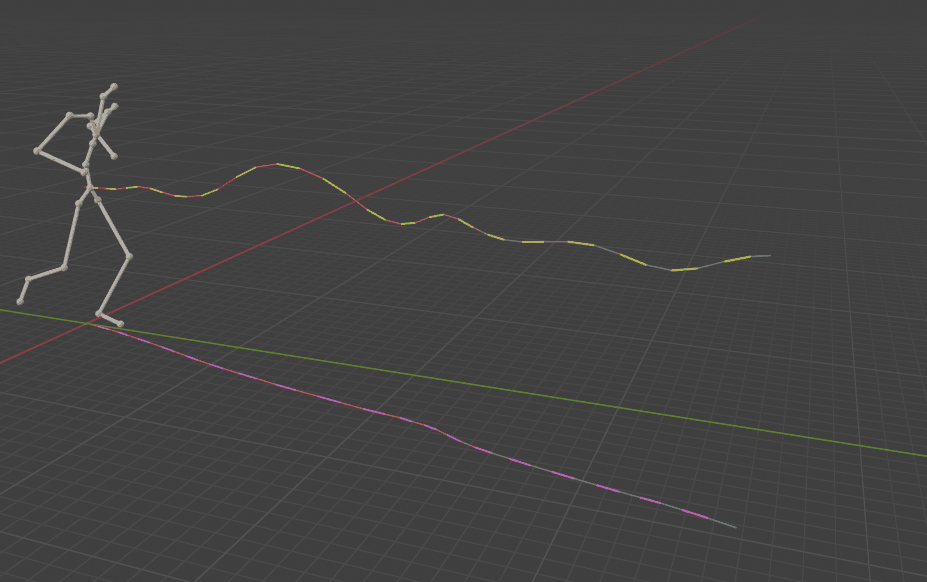
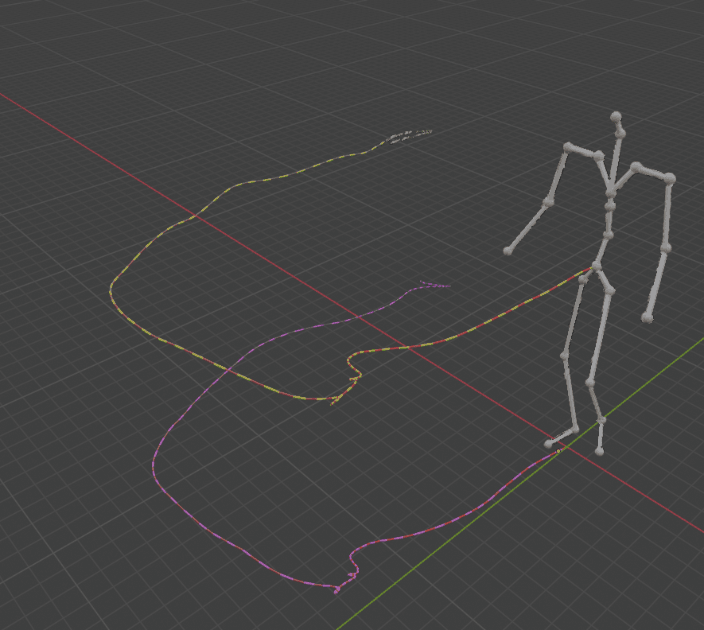
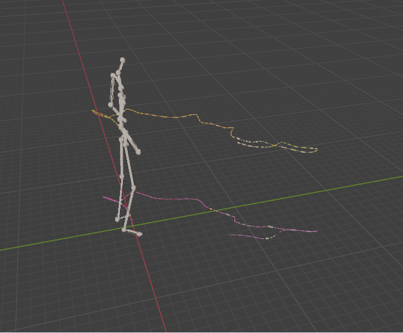
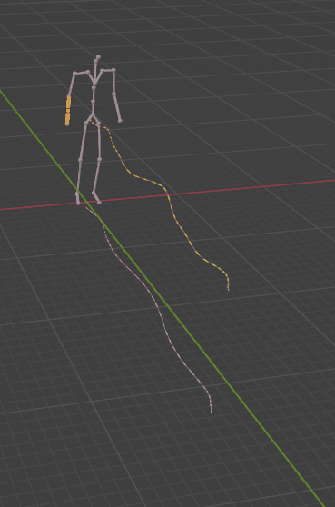
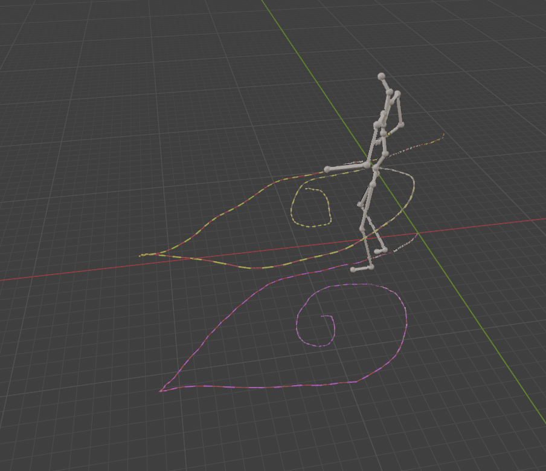
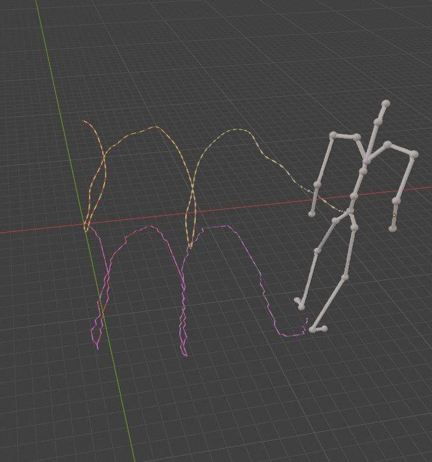
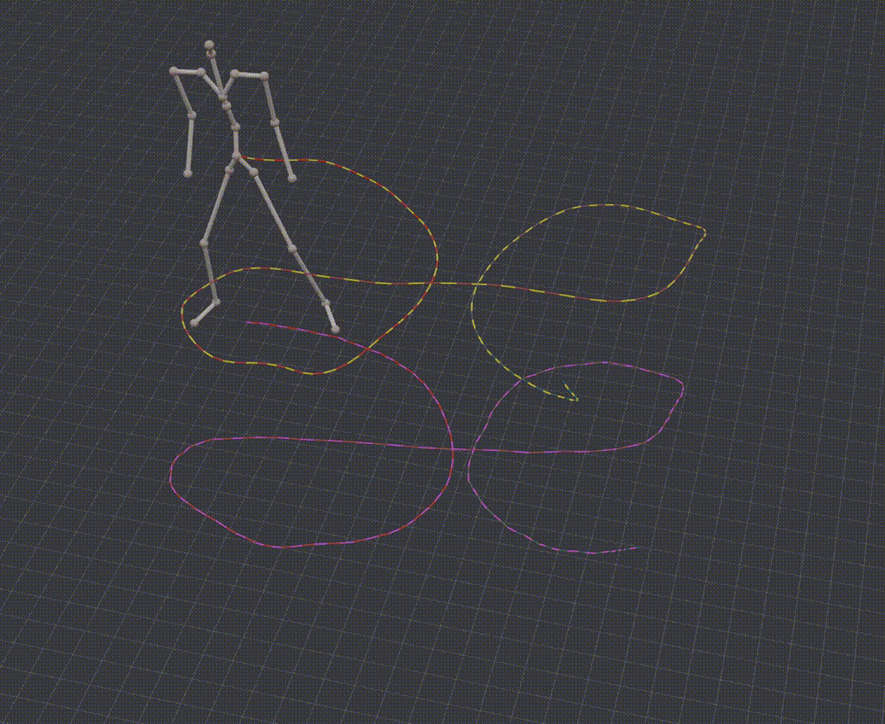
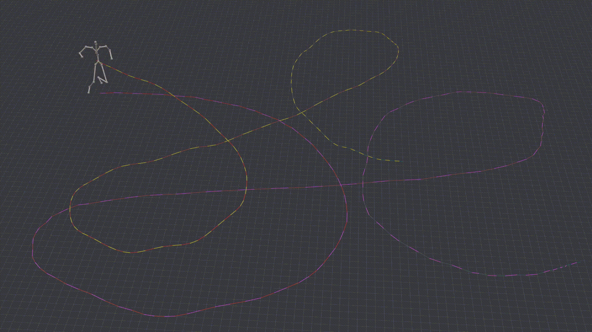

 # DrawMotion: Generating 3D Human Motions by Freehand Drawing

## Abstract
Text-to-motion generation, which translates textual descriptions into human motions, faces the challenge that users often struggle to precisely convey their intended motions through text alone. To address this issue, this paper introduces **DrawMotion**}, an efficient diffusion-based framework designed for multi-condition scenarios. DrawMotion generates motions based not only on conventional text conditions but also on a novel hand-drawing condition, which provides semantic and spatial control over the generated motions. Specifically, we tackle the fine-grained motion generation task from three perspectives: 1) **Freehand drawing condition.**} To accurately capture users' intended motions without requiring tedious textual input, we develop an algorithm to automatically generate hand-drawn stick figures (stickman) across different dataset formats. In addition, a 2D trajectory condition is incorporated into DrawMotion to achieve improved global spatial control. 2) **Multi-Condition Fusion.**} We propose a Multi-Condition Module (MCM) that is integrated into the diffusion process, enabling the model to exploit all possible condition combinations while reducing computational complexity compared to conventional approaches. 3) **Training-free guidance.**} Notably, the MCM in DrawMotion ensures that its intermediate features lie in a relatively continuous space, allowing classifier guidance gradients to update the features and thereby aligning the generated motions with user intentions while preserving fidelity. Quantitative experiments and user studies demonstrate that the freehand drawing approach reduces user time by approximately 46.7\% when generating motions aligned with their imagination.


### Demo
|  |  | |
|-------|-------|-------|
|  | ||
|  |||

### Unreasonable signal (overly large trajectories)
|  |  | |
|-----|-----|-----|
|  | ||
### Done
- The training and evaluation code on both KIT-ML and HumanML3D datasets. 

### TODO
- A complete interactive demo.


## Environment Setup

### Python Install
```
pip install -r requirements.txt
```

### Prepare Data
**Dataset data,** refer to [ReModiffuse](https://github.com/mingyuan-zhang/ReMoDiffuse#:~:text=r%20requirements.txt-,Data%20Preparation,-Download%20data%20files).


**Weight data,** refer to Google Drive as shown below.

The directory sructure of the repository should look like this:

```
DrawMotion
├── mogen
├── tools
├── configs
├── stickman
│   ├── weight [1]
│   └── interaction
├── logs [2]
│   ├── human_ml3d
│   └── kit_ml
└── data [3]
    ├── database
    ├── datasets
    ├── evaluators
    └── glove

[1] https://drive.google.com/drive/folders/1yykLJbIPlt818T-2MM54D_KgrwKOhtCs?usp=sharing
[2] https://drive.google.com/drive/folders/197CvTrZhLFjQ0GmPQipH9ymdR0csb1sD?usp=sharing
[3] https://github.com/mingyuan-zhang/ReMoDiffuse
```

## Getting Started

### Evaluation

```
# KIT-ML
python tools/lg_test.py logs/kit_ml/last.ckpt 0
# arg1: path to the checkpoint
# arg2: gpu id

# HumanML3D
python tools/lg_test.py logs/human_ml3d/last.ckpt 0
```


### Training

```
# KIT-ML
python tools/lg_train.py configs/remodiffuse/remodiffuse_kit.py  VERSION_NAME 0
# arg1: path to the config file
# arg2: VERSION_NAME, which will be used to save the model, logs, and codes
# arg3: gpu id

# HumanML3D
python tools/lg_train.py configs/remodiffuse/remodiffuse_t2m.py  VERSION_NAME 0
```