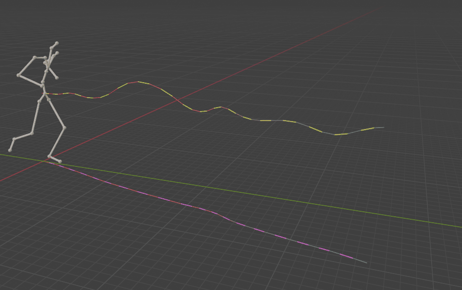
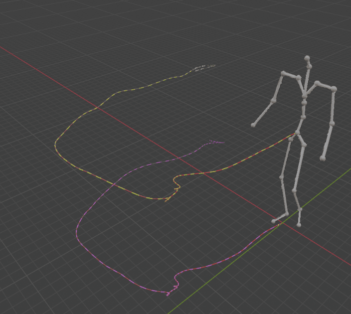
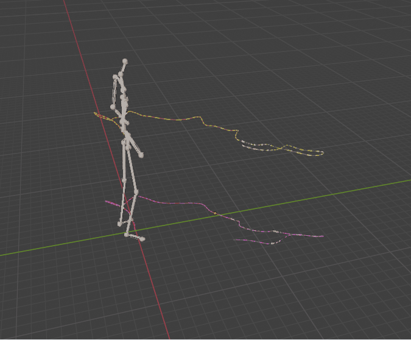
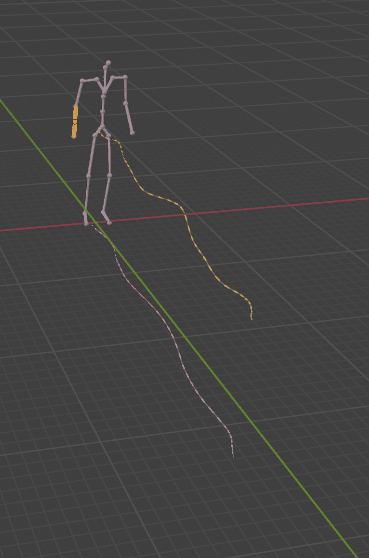
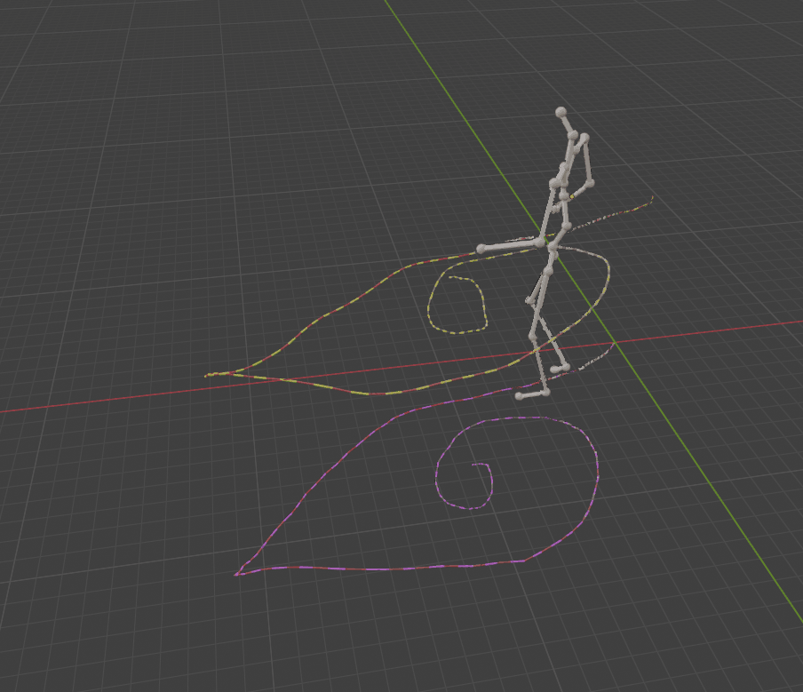
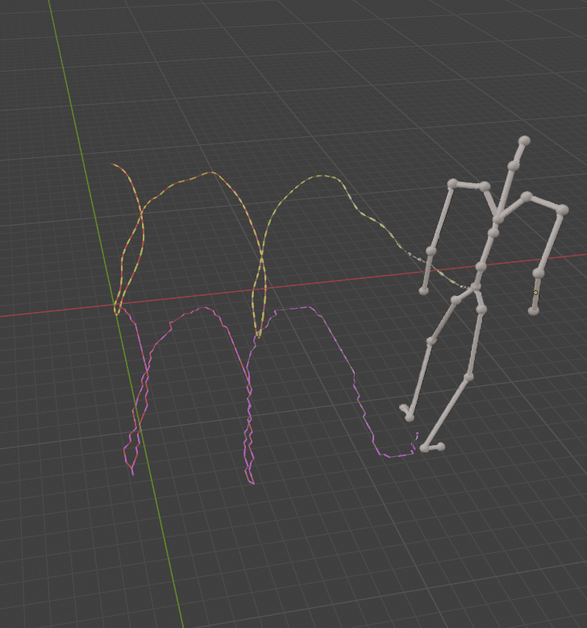
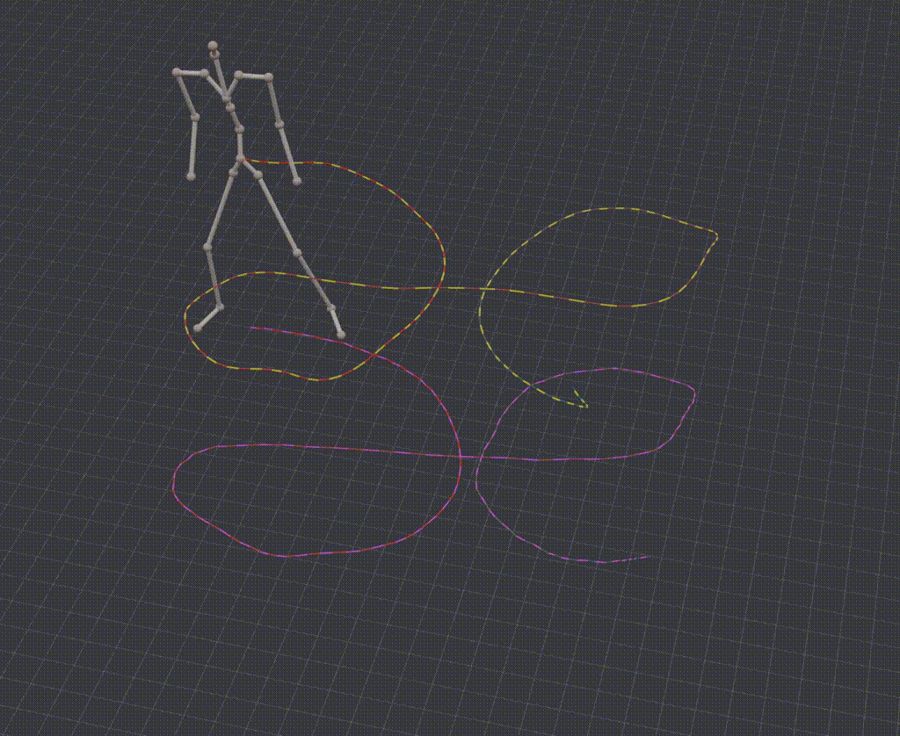
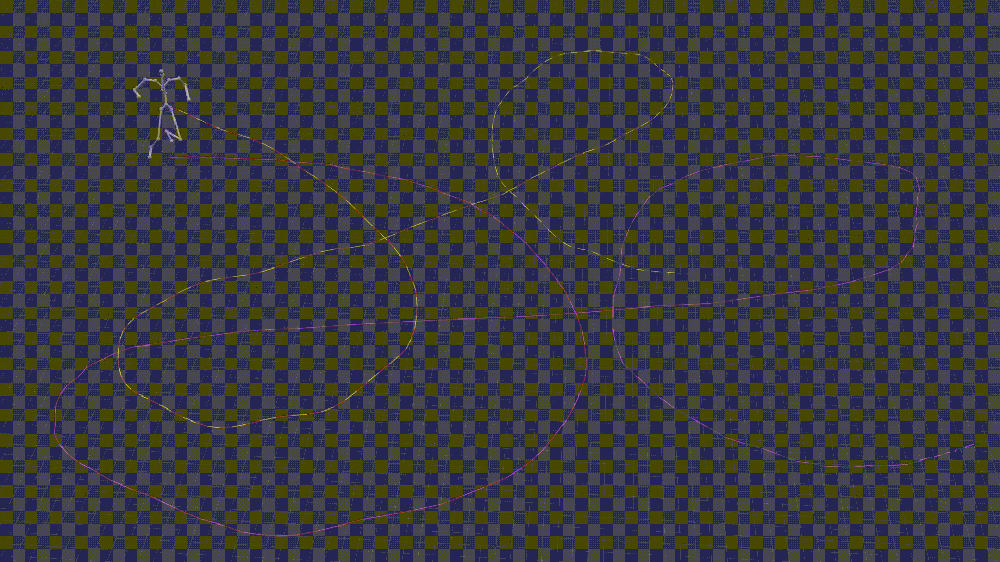

 # DrawMotion: Generating 3D Human Motions by Freehand Drawing


<p align="center">
  <a href="https://youtu.be/sy2QTdDD09A">
    
  </a>
</p>


## Abstract
Text-to-motion generation, which translates textual descriptions into human motions, faces the challenge that users often struggle to precisely convey their intended motions through text alone. To address this issue, this paper introduces **DrawMotion**, an efficient diffusion-based framework designed for multi-condition scenarios. DrawMotion generates motions based not only on conventional text conditions but also on a novel hand-drawing condition, which provides semantic and spatial control over the generated motions. Specifically, we tackle the fine-grained motion generation task from three perspectives: 1) **Freehand drawing condition.** To accurately capture users' intended motions without requiring tedious textual input, we develop an algorithm to automatically generate hand-drawn stick figures (stickman) across different dataset formats. In addition, a 2D trajectory condition is incorporated into DrawMotion to achieve improved global spatial control. 2) **Multi-Condition Fusion.** We propose a Multi-Condition Module (MCM) that is integrated into the diffusion process, enabling the model to exploit all possible condition combinations while reducing computational complexity compared to conventional approaches. 3) **Training-free guidance.** Notably, the MCM in DrawMotion ensures that its intermediate features lie in a relatively continuous space, allowing classifier guidance gradients to update the features and thereby aligning the generated motions with user intentions while preserving fidelity. Quantitative experiments and user studies demonstrate that the freehand drawing approach reduces user time by approximately 46.7\% when generating motions aligned with their imagination.


### Demo
|  |  | |
|-------|-------|-------|
|  | ||
|  |||

### Unreasonable signal (overly large trajectories)
|  |  | |
|-----|-----|-----|
|  | ||

### Done
- Public web demo with text and trajectory control.
- Training and evaluation code on both KIT-ML and HumanML3D datasets.

### Note
- We fixed a training/evaluation bug and obtained improved quantitative scores. The revised arXiv version is under review.
- The current public demo exposes text and trajectory control only. A stickman-conditioned version is coming soon.
- The current stickman drawing order is head -> spine -> right arm -> left arm -> right leg -> left leg. This order follows natural drawing habits and helps the stickman representation distinguish left from right.


## Environment Setup

### Python Install
```
pip install -r requirements.txt
```

### Prepare Weights and Data
For the web demo, download the required model assets from [Hugging Face](https://huggingface.co/I0u0I/DrawMotion). Dataset downloads are not required for the demo.

```bash
pip install -U huggingface_hub
hf download I0u0I/DrawMotion \
  --local-dir . \
  --include "logs/human_ml3d/last.ckpt" \
            "mid_feat/t2m/mid_feat.pt" \
            "stickman/weight/real_init/t2m/stickman_encoder.ckpt"
```

For training or quantitative evaluation, also prepare the HumanML3D/KIT-ML data following [ReMoDiffuse](https://github.com/mingyuan-zhang/ReMoDiffuse#:~:text=r%20requirements.txt-,Data%20Preparation,-Download%20data%20files).

The directory structure of the repository should look like this:

```
DrawMotion
├── mogen
├── tools
├── configs
├── stickman
│   ├── weight
│   └── interaction
├── logs
│   ├── human_ml3d
│   └── kit_ml
├── mid_feat
│   └── t2m
│       └── mid_feat.pt
└── data [1]
    ├── database
    ├── datasets
    ├── evaluators
    └── glove

[1] https://github.com/mingyuan-zhang/ReMoDiffuse
```

## Getting Started

### Training

```
# KIT-ML
python tools/lg_train.py configs/remodiffuse/remodiffuse_kit.py  VERSION_NAME 0
# arg1: path to the config file
# arg2: VERSION_NAME, which will be used to save the model, logs, and codes
# arg3: gpu id

# HumanML3D
python tools/lg_train.py configs/remodiffuse/remodiffuse_t2m.py  VERSION_NAME 0
```

### Getting intermediate feature statistics (for training-free guidance)
```
# KIT-ML
python tools/lg_test.py logs/kit_ml/last.ckpt 0
# arg1: path to the checkpoint
# arg2: gpu id

# HumanML3D
python tools/lg_test.py logs/human_ml3d/last.ckpt 0
```


### Evaluation
Please use single-gpu first to get the intermediate feature statistics, which are required for training-free guidance. After that, you can use multi-gpu for evaluation.
```
# KIT-ML
python tools/lg_test.py logs/kit_ml/last.ckpt 0
# arg1: path to the checkpoint
# arg2: gpu id

# HumanML3D
python tools/lg_test.py logs/human_ml3d/last.ckpt 0
```

## Web Demo Reproduction

The web demo is the shortest path for reproducing the interactive DrawMotion experience. It does not build or read the HumanML3D/KIT-ML datasets. The backend creates an empty motion template, then applies the text prompt and hand-drawn trajectory from the browser.

Required files for the default HumanML3D demo:

- `logs/human_ml3d/last.ckpt`
- `mid_feat/t2m/mid_feat.pt`
- `stickman/weight/real_init/t2m/stickman_encoder.ckpt`

Run from the repository root:

```bash
DRAWMOTION_CKPT=logs/human_ml3d/last.ckpt \
DRAWMOTION_GPU=0 \
uvicorn demo.drawmotion_studio.app:app --host 0.0.0.0 --port 12008
```

Then open `http://<server>:12008` in a browser. The model is loaded lazily on the first generation request, so `GET /api/status` can report `loaded: false` before the first run.

### Demo Parameters

- `Text`: global motion semantics.
- `Trajectory`: hand-drawn pelvis/root path.
- `Scale`: trajectory size multiplier.
- `Frames`: generated motion length, from `2` to `196`.
- `Alpha`: trajectory resampling; `0` is uniform by arc length, larger values preserve more drawing speed.
- `IFG repeat`: training-free guidance refinement steps.
- `IFG scale`: training-free guidance strength.

Use the full dataset preparation instructions only if you want to train models, recompute IFG statistics, or run quantitative evaluation.

## Discussion

Recent systems such as [Kimodo](https://research.nvidia.com/labs/sil/projects/kimodo/) also support controllable motion generation with text and kinematic constraints. A key difference is the motion representation: Kimodo uses a smoothed global root trajectory together with global joint positions/rotations, so path constraints can be imposed more directly in absolute coordinates. DrawMotion follows the widely used HumanML3D-style local-relative representation, where the root trajectory is encoded through incremental velocity features and recovered by integration. Applying freehand trajectory control under this indirect representation is therefore a stricter setting for spatial guidance.

The proposed IFG strategy is not limited to human motion generation. It can be applied to other diffusion-based generation tasks when intermediate conditional features are available and a differentiable condition error can be defined, enabling training-free refinement without retraining the denoising model.

## Citation

If you find DrawMotion useful, please cite:

```bibtex
@article{wang2026drawmotion,
  title={DrawMotion: Generating 3D Human Motions by Freehand Drawing},
  author={Wang, Tao and Jin, Lei and Wu, Zhihua and He, Qiaozhi and Chu, Jiaming and Cheng, Yu and Xing, Junliang and Zhao, Jian and Yan, Shuicheng and Wang, Li},
  journal={IEEE Transactions on Pattern Analysis and Machine Intelligence},
  year={2026},
  pages={1--17},
  doi={10.1109/TPAMI.2026.3679530}
}
```
